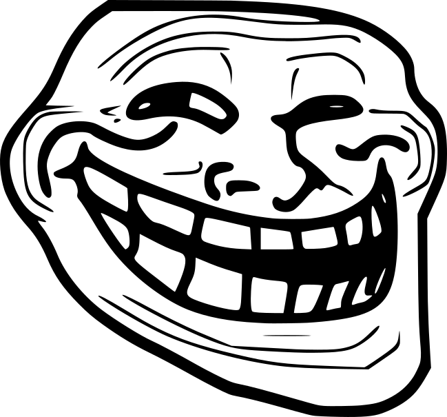
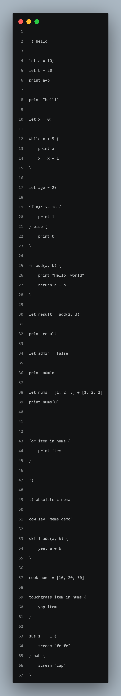

# MemeLang :)

[](https://memelangg.netlify.app/)

The most serious non-serious programming language.



MemeLang is a fun programing language build from scratch in rust.


Instead of boring keywords, MemeLang embraces internet culture with meme-inspired syntax while still teaching real programming concepts such as variables, loops, functions, conditions, lists, and more.

> Warning: MemeLang is not designed for serious production use. It is designed for learning, experimentation, and absolute chaos.


---

## Features

* Meme-syntax
* Variables
* Printing and output
* If / Else stataments
* While loops
* For loop
* Function
* Return values
* Lists and indexing
* Comments
* Written in Rust
* Beginner friendly

---


## Hello World

```meow
yap "Hello, World!"
```

---


## Building

Clone the repository:

```bash
git clone https://github.com/cyberworrier8088/memeLang.git
cd memeLang
```


Build:

```bash
cargo build
```

Optimized release build:

```bash
cargo build --release
```

Run:

```bash
cargo run -- program.meow
```

Or use the compiled executable in Website download and :

```bash
memeLang.exe program.meow
```

---
## Code
## Screenshot



---

## Current Status

MemeLang is currently under active development.

Implemented:

* Variables
* Functions
* If / Else
* While Loops
* For Loops
* Lists
* Indexing
* Meme Keywords


---


---
## License
MIT